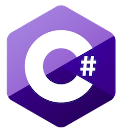

# Examples

[This folder](.) contains some .Net Framework examples.

## [mscorelib](mscorelib/README.md)

* [Hello Worlds](mscorelib/HelloWorlds/README.md) ontains .Net Framework "Hello, World!" examples.
* [Array](mscorelib/Array/README.md) contains Array examples.
* [Delegates](mscorelib/Delegates/README.md) contains delegates examples.
* [Console](mscorelib/Console/README.md) contains console examples.
* [Others](mscorelib/Others/README.md) contains others examples.

## System

* [System](./System/README.md) contains System library examples.
* [System.Core](./System.Core/README.md) contains System.Core library examples.

## Drawing

* [System.Drawing](./System.Drawing/README.md) contains System.Drawing library examples.

## Forms

* [System.Windows.Forms (Winforms)](./System.Windows.Forms/README.md) contains System.Windows.Forms library examples.

## UnitTesting

* [Microsoft.VisualStudio.TestTools.UnitTesting](./Microsoft.VisualStudio.TestTools.UnitTesting/README.md) contains Microsoft.VisualStudio.TestTools.UnitTesting library examples.

## Design patterns

* [DesignPatterns](./DesignPatterns/README.md) contains the 23 Gang of Four (GoF) patterns examples.

## Demos

## Tutorials

## Other

* [All](.) You can see all libraries examples here. 
