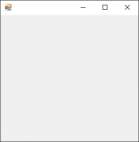

# Application

[This example](.) demonstrates the use of System.Windows.Forms.Application class.

# Sources

[Application.cs](Application.cs)

# Build and run

Open [Application.csproj](Application.csproj)

# Output

