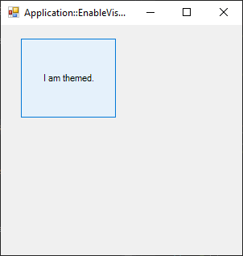

# ApplicationEnableVisualStyle

[This example](.) demonstrates the use of System.Windows.Forms.Application.EnableVisualStyle method.

# Sources

[ApplicationEnableVisualStyle.cs](ApplicationEnableVisualStyle.cs)

# Build and run

Open [ApplicationEnableVisualStyle.csproj](ApplicationEnableVisualStyle.csproj)

# Output

