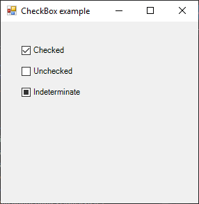

# CheckBox

[This example](.) demonstrates the use of System.Windows.Forms.CheckBox control.

# Sources

[CheckBox.cs](CheckBox.cs)

# Build and run

Open [CheckBox.csproj](CheckBox.csproj)

# Output

