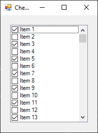

# CheckedListBox

[This example](.) demonstrates the use of System.Windows.Forms.CheckedListBox control.

# Sources

[CheckedListBox.cs](CheckedListBox.cs)

# Build and run

Open [CheckedListBox.csproj](CheckedListBox.csproj)

# Output

