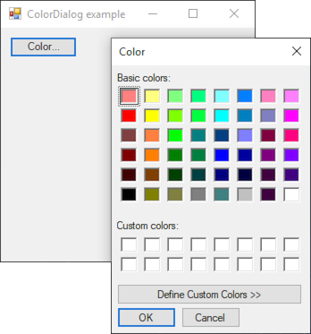

# ColorDialog

[This example](.) demonstrates the use of System.Windows.Forms.ColorDialog dialog.

# Sources

[ColorDialog.cs](ColorDialog.cs)

# Build and run

Open [ColorDialog.csproj](ColorDialog.csproj)

# Output

