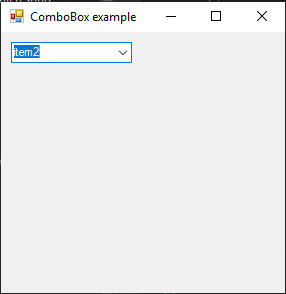

# ComboBox

[This example](.) demonstrates the use of System.Windows.Forms.ComboBox control.

# Sources

[ComboBox.cs](ComboBox.cs)

# Build and run

Open [ComboBox.csproj](ComboBox.csproj)

# Output

