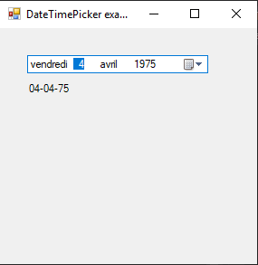

# DateTimePicker

[This example](.) demonstrates the use of System.Windows.Forms.DateTimePicker control.

# Sources

[DateTimePicker.cs](DateTimePicker.cs)

# Build and run

Open [DateTimePicker.csproj](DateTimePicker.csproj)

# Output

