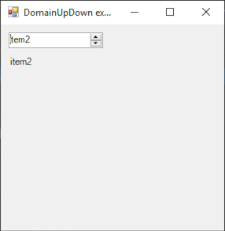

# DomainUpDown

[This example](.) demonstrates the use of System.Windows.Forms.DomainUpDown control.

# Sources

[DomainUpDown.cs](DomainUpDown.cs)

# Build and run

Open [DomainUpDown.csproj](DomainUpDown.csproj)

# Output

