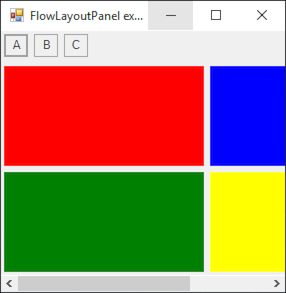

# FlowLayoutPanel

[This example](.) demonstrates the use of System.Windows.Forms.FlowLayoutPanel control.

# Sources

[FlowLayoutPanel.cs](FlowLayoutPanel.cs)

# Build and run

Open [FlowLayoutPanel.csproj](FlowLayoutPanel.csproj)

# Output

