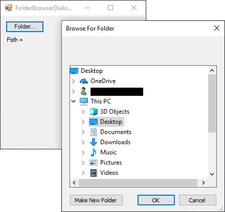

# FolderBrowserDialog

[This example](.) demonstrates the use of System.Windows.Forms.FolderBrowserDialog dialog.

# Sources

[FolderBrowserDialog.cs](FolderBrowserDialog.cs)

# Build and run

Open [ColorDialog.csproj](FolderBrowserDialog.csproj)

# Output

