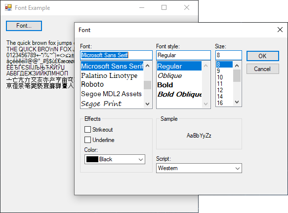

# FontDialog

[This example](.) demonstrates the use of System.Windows.Forms.FontDialog dialog.

# Sources

[FontDialog.cs](FontDialog.cs)

# Build and run

Open [FontDialog.csproj](FontDialog.csproj)

# Output

