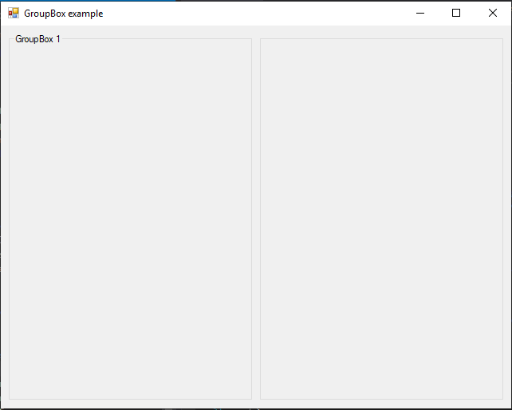

# GroupBox

[This example](.) demonstrates the use of System.Windows.Forms.GroupBox control.

# Sources

[GroupBox.cs](GroupBox.cs)

# Build and run

Open [GroupBox.csproj](GroupBox.csproj)

# Output

