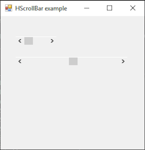

# HScrollBar

[This example](.) demonstrates the use of System.Windows.Forms.HScrollBar control.

# Sources

[HScrollBar.cs](HScrollBar.cs)

# Build and run

Open [HScrollBar.csproj](HScrollBar.csproj)

# Output

