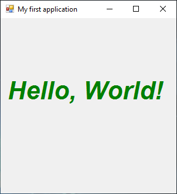

# HelloWorldForm

[This example](.) illustrate the classic first application ‘Hello World’.

# Sources

[HelloWorldForm.cs](HelloWorldForm.cs)

# Build and run

Open [HelloWorldForm.csproj](HelloWorldForm.csproj)

# Output

Windows :

