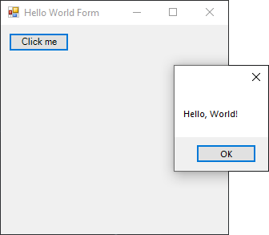

# HelloWorldMessageBox

[This example](.) illustrate the classic first application ‘Hello World’.

# Sources

[HelloWorldMessageBox.cs](HelloWorldMessageBox.cs)

# Build and run

Open [HelloWorldMessageBox.csproj](HelloWorldMessageBox.csproj)

# Output

