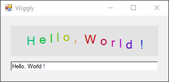

# HelloWorldPaint

[This example](.) illustrate the classic first application ‘Hello World’.

# Sources

[HelloWorldPaint.cs](HelloWorldPaint.cs)

# Build and run

Open [HelloWorldPaint.csproj](HelloWorldPaint.csproj)

# Output

