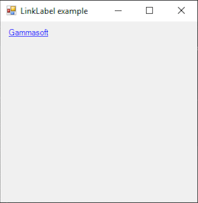

# LinkLabel

[This example](.) demonstrates the use of System.Windows.Forms.LinkLabel control.

# Sources

[LinkLabel.cs](LinkLabel.cs)

# Build and run

Open [LinkLabel.csproj](LinkLabel.csproj)

# Output

