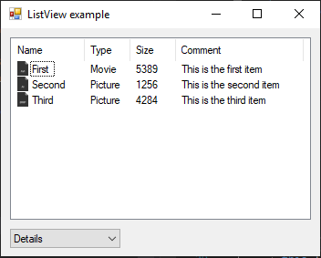

# ListView

[This example](.) demonstrates the use of System.Windows.Forms.ListView control.

# Sources

[ListView.cs](ListView.cs)

[Resources\Ai.png](Resources\Ai.png)

[Resources\Avi.png](Resources\Avi.png)

[Resources\Bmp.png](Resources\Bmp.png)

# Build and run

Open [ListView.csproj](ListView.csproj)

# Output

