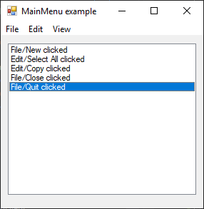

# MainMenu

[This example](.) demonstrates the use of System.Windows.Forms.MainMenu control.

# Sources

[MainMenu.cs](MainMenu.cs)

# Build and run

Open [MainMenu.csproj](MainMenu.csproj)

# Output

