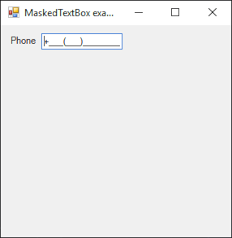

# MaskedTextBox

[This example](.) demonstrates the use of System.Windows.Forms.MaskedTextBox  control.

# Sources

[MaskedTextBox.cs](MaskedTextBox.cs)

# Build and run

Open [MaskedTextBox.csproj](MaskedTextBox.csproj)

# Output

