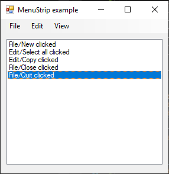

# MenuStrip

[This example](.) demonstrates the use of System.Windows.Forms.MenuStrip control.

# Sources

[MenuStrip.cs](MenuStrip.cs)

# Build and run

Open [MenuStrip.csproj](MenuStrip.csproj)

# Output

