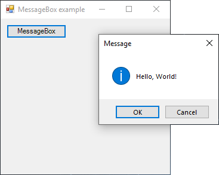

# MessageBox

[This example](.) demonstrates the use of System.Windows.Forms.MessageBox dialog.

# Sources

[MessageBox.cs](MessageBox.cs)

# Build and run

Open [MessageBox.csproj](MessageBox.csproj)

# Output

