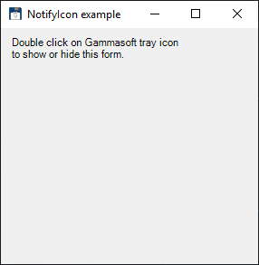

# NotifyIcon

[This example](.) demonstrates the use of System.Windows.Forms.NotifyIcon control.

# Sources

[NotifyIcon.cs](NotifyIcon.cs)

# Build and run

Open [NotifyIcon.csproj](NotifyIcon.csproj)

# Output

