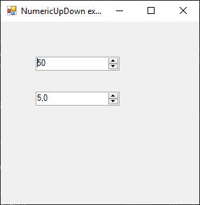

# NumericUpDown

[This example](.) demonstrates the use of System.Windows.Forms.NumericUpDown control.

# Sources

[NumericUpDown.cs](NumericUpDown.cs)

# Build and run

Open [NumericUpDown.csproj](NumericUpDown.csproj)

# Output

