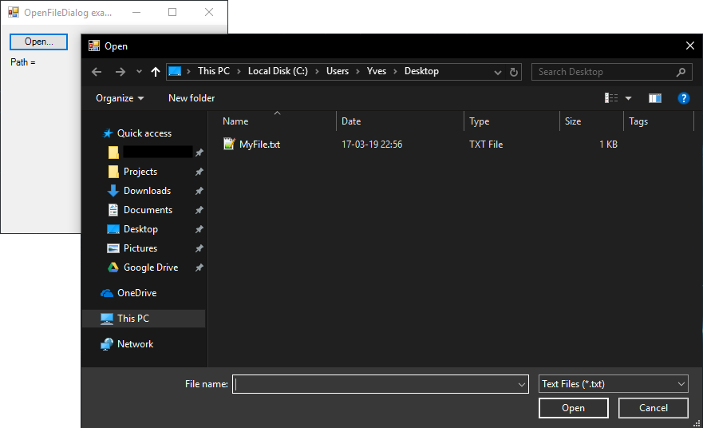

# OpenFileDialog

[This example](.) demonstrates the use of System.Windows.Forms.OpenFileDialog dialog.

# Sources

[OpenFileDialog.cs](OpenFileDialog.cs)

# Build and run

Open [OpenFileDialog.csproj](OpenFileDialog.csproj)

# Output

