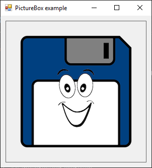

# PictureBox

[This example](.) demonstrates the use of System.Windows.Forms.PictureBox control.

# Sources

[PictureBox.cs](PictureBox.cs)

# Build and run

Open [PictureBox.csproj](PictureBox.csproj)

# Output

