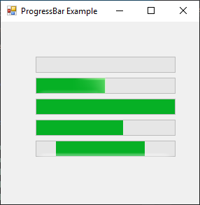

# ProgressBar

[This example](.) demonstrates the use of System.Windows.Forms.ProgressBar control.

# Sources

[ProgressBar.cs](ProgressBar.cs)

# Build and run

Open [ProgressBar.csproj](ProgressBar.csproj)

# Output

