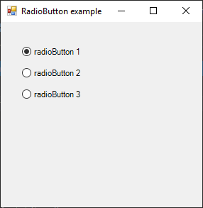

# RadioButton

[This example](.) demonstrates the use of System.Windows.Forms.RadioButton control.

# Sources

[RadioButton.cs](RadioButton.cs)

# Build and run

Open [RadioButton.csproj](RadioButton.csproj)

# Output

