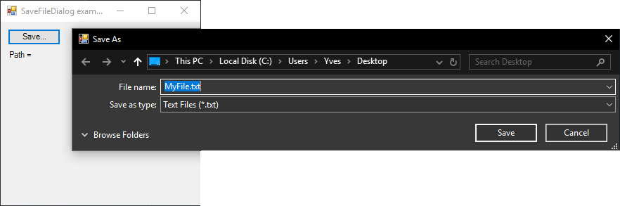
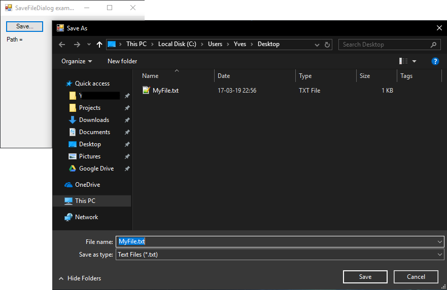

# SaveFileDialog

[This example](.) demonstrates the use of System.Windows.Forms.SaveFileDialog dialog.

# Sources

[SaveFileDialog.cs](SaveFileDialog.cs)

# Build and run

Open [SaveFileDialog.csproj](SaveFileDialog.csproj)

# Output

