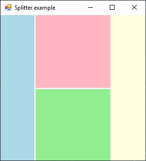

# Splitter

[This example](.) demonstrates the use of System.Windows.Forms.Splitter control.

# Sources

[Splitter.cs](Splitter.cs)

# Build and run

Open [Splitter.csproj](Splitter.csproj)

# Output

