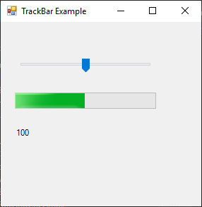

# TrackBar

[This example](.) demonstrates the use of System.Windows.Forms.TrackBar control.

# Sources

[TrackBar.cs](TrackBar.cs)

# Build and run

Open [TrackBar.csproj](TrackBar.csproj)

# Output

