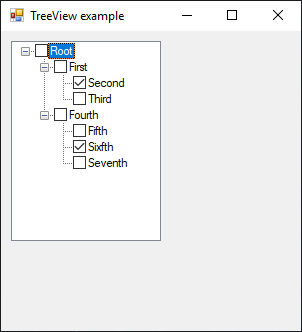

# TreeView

[This example](.) demonstrates the use of System.Windows.Forms.TreeView control.

# Sources

[TreeView.cs](TreeView.cs)

# Build and run

Open [TreeView.csproj](TreeView.csproj)

# Output

