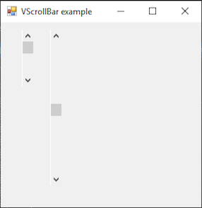

# VScrollBar

[This example](.) demonstrates the use of System.Windows.Forms.VScrollBar control.

# Sources

[VScrollBar.cs](VScrollBar.cs)

# Build and run

Open [VScrollBar.csproj](VScrollBar.csproj)

# Output

