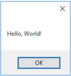

# Action1

Shows how to use  [System.Action](https://learn.microsoft.com/en-us/dotnet/api/system.action). 

## Sources

* [src/Action1.cs](src/Action1.cs)
* [CMakeLists.txt](CMakeLists.txt)

## Build and run

To build this project, open "Terminal" and type following lines:

```batch
mkdir build && cd build
cmake ..
start Action1.sln
```

Select `Action1` project and type Ctrl+F5 to build and run it.

## Output

* If `Action1` is called without param

```
Hello, World!
```

* If `Action1` is called with any param


